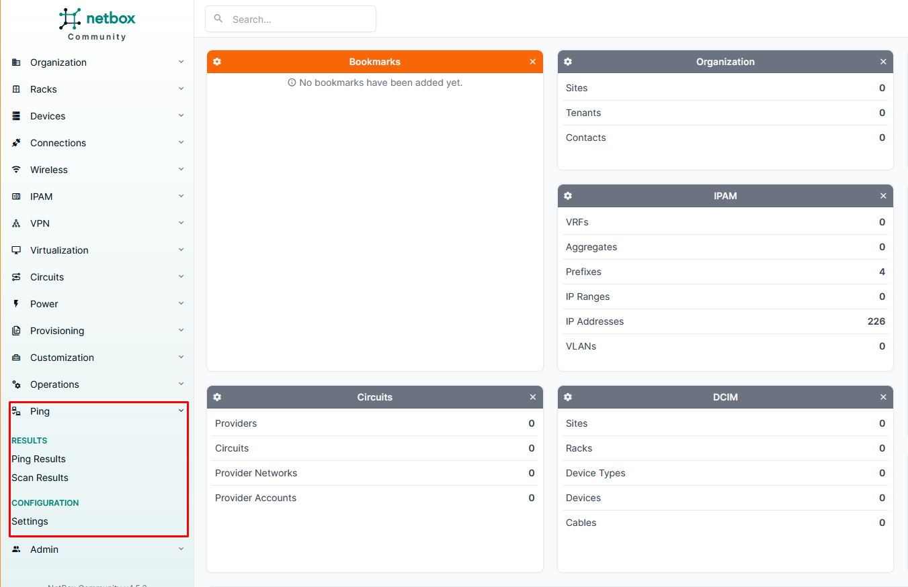

## Hướng dẫn cài đặt plugin netbox ping
**NetBox-Ping** là một plugin mở rộng dành cho NetBox, được phát triển bởi DenDanskeMine.
Plugin này sử dụng giao thức IMCP để phát hiện IP đang sử dụng (những IP chặn ping không phát hiện được). Kết hợp với netbox thì khi sử dụng plugin sẽ cung cấp cho ta giao diện dễ dàng nhìn hơn và thực thi quét dải IP lớn chỉ bằng 1 click
### 1. Netbox ping làm được gì?
- Ping IP trực tiếp trong NetBox
  - Gửi ICMP Echo Request từ server NetBox
  - Hiển thị trạng thái phản hồi
  - Cập nhật trạng thái online/offline
  - Có thể sử dụng cho từng IP riêng lẻ
- Quét toàn bộ Prefix (Subnet Scan)
  - Thực hiện ping hàng loạt các IP trong một prefix
  - Tự động xác định IP đang hoạt động
  - Hữu ích cho kiểm tra nhanh tình trạng subnet
- Discovery IP đang hoạt động
  - Phát hiện IP trả lời ping nhưng chưa tồn tại trong NetBox
  - Có thể hỗ trợ tạo bản ghi IP mới
  - Giúp đồng bộ giữa dữ liệu IPAM và thực tế hạ tầng
- Tích hợp vào giao diện quản trị
  - Xuất hiện trong menu Plugins
  - Thao tác trực tiếp trên object IP Address hoặc Prefix
### 2. Hướng dẫn cài đặt
Plugin có thể cài đặt bằng pip hoặc download trực tiếp source code về sử dụng.
Trong bài viết này sẽ sử dụng cách dễ nhất là dùng pip để cài đặt.
**Lưu ý:** Phiên bản netbox được sử dụng là 4.5 được cài đặt trên ubuntu 24.04
**Cài đặt từ PyPi**
```
source /opt/netbox/venv/bin/activate
pip install netbox-ping
```
**Kích hoạt Plugin**
Cần phải sửa file config của netbox 
```
vi /opt/netbox/netbox/netbox/configuration.py
```
Thêm plugin
```
PLUGINS = [
    'netbox_ping',
]
```
**Áp dụng**
```
cd /opt/netbox/netbox
python3 manage.py migrate
sudo systemctl restart netbox netbox-rq
```
**Kiểm tra kết quả**

