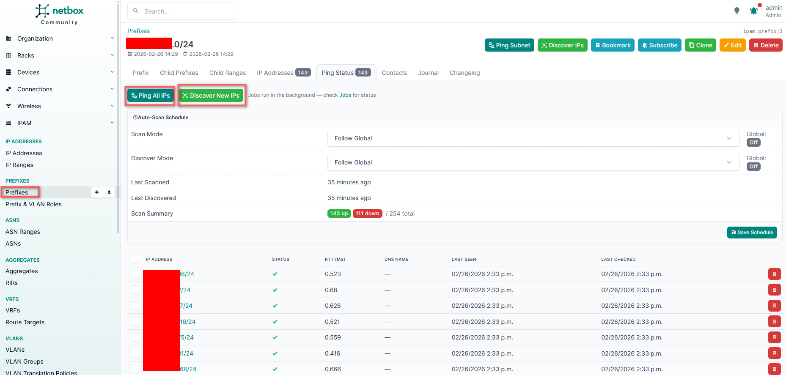

## Hướng dẫn sử dụng NetBox Ping Plugin

## 1. Settings Page

Trước tiên, chúng ta cùng xem qua **trang Settings** để hiểu plugin có những cấu hình gì.

Trang này được tạo ra nhằm:

- Cấu hình cách plugin thực hiện ping để kiểm tra trạng thái IP
- Cấu hình DNS lookup (reverse DNS)
- Thiết lập cơ chế tự động quét IP theo lịch
- Kiểm soát hiệu năng (số luồng, timeout, lịch sử ping…)
- Thiết lập email báo cáo kết quả quét

Các nhóm cấu hình quan trọng bao gồm:

---

### A. DNS Configuration

Dùng để thực hiện reverse DNS lookup và đồng bộ hostname vào NetBox.

#### Primary / Secondary / Tertiary DNS Server
Các DNS server được sử dụng để phân giải IP → hostname.

#### Perform DNS Lookups
Bật hoặc tắt chức năng reverse DNS lookup.

#### Sync DNS to NetBox
Tự động ghi hostname tìm được vào trường `dns_name` của đối tượng IPAddress trong NetBox.

#### Clear DNS on Missing
Nếu DNS không trả về hostname, plugin sẽ xóa giá trị `dns_name` hiện có.

#### Preserve DNS if Alive
Nếu IP vẫn ping được nhưng DNS lookup thất bại, plugin sẽ giữ lại hostname cũ.  
(Khuyến nghị bật để tránh mất dữ liệu ngoài ý muốn)

---

### B. Auto-Scan Configuration

Điều khiển cơ chế tự động quét IP.

#### Enable Auto-Scan
Tự động ping các IP đã tồn tại trong prefix theo lịch định kỳ.

#### Auto-Scan Interval
Chu kỳ thực hiện quét (ví dụ: mỗi 5 phút).

#### Enable Auto-Discover
Tự động phát hiện các IP mới xuất hiện trong prefix.

#### Auto-Discover Interval
Chu kỳ quét để phát hiện IP mới.

#### Minimum Prefix Length
Chỉ quét các prefix có độ dài từ giá trị này trở lên.  

Ví dụ:
- Giá trị `24` → chỉ quét các mạng `/24`, `/25`, `/26`…
- Giúp tránh quét các mạng quá lớn như `/16` hoặc `/8`

---

### C. Hiệu năng & Tài nguyên

#### Max Ping History Records
Số lượng bản ghi lịch sử ping tối đa được lưu trữ.  
`0` = không giới hạn (có thể khiến database tăng dung lượng nhanh).

#### Concurrent Pings
Số lượng luồng ping chạy song song.  
Giá trị càng cao → quét càng nhanh nhưng tiêu tốn CPU/RAM nhiều hơn.

#### Ping Timeout (seconds)
Thời gian chờ phản hồi trước khi đánh dấu IP là **Down**.

Gợi ý:
- Mạng LAN: `0.3 – 0.5` giây
- Mạng WAN: `1 – 2` giây

#### Skip Reserved IPs
Bỏ qua các IP có trạng thái **Reserved** khi thực hiện quét.

---

### D. Email Notifications

Dùng để gửi báo cáo tổng hợp kết quả quét.

#### Enable Email Notifications
Bật hoặc tắt chức năng gửi email báo cáo.

#### Email Recipients
Danh sách địa chỉ email nhận báo cáo (phân cách bằng dấu phẩy).

#### Digest Interval
Chu kỳ gửi báo cáo (Daily, Weekly…).  
`0` = không gửi báo cáo định kỳ.

#### Include Details
Gửi kèm bảng chi tiết các IP có thay đổi trạng thái.

#### Utilization Alert Threshold (%)
Cảnh báo khi mức sử dụng IP trong prefix vượt quá ngưỡng cấu hình.

#### Send on Change Only
Chỉ gửi email khi có thay đổi trạng thái IP.  
(Khuyến nghị bật để tránh gửi email quá nhiều)

---

## 2. Hướng dẫn sử dụng

Để sử dụng plugin, bạn chỉ cần có dải IP hoặc Prefix trong mục **IPAM**.  
Plugin sẽ tự động tiến hành scan IP theo lịch đã thiết lập (nếu bật Auto-Scan hoặc Auto-Discover).

### Scan thủ công (On-demand)

Nếu muốn thực hiện quét ngay lập tức, bạn chỉ cần vào trang Prefix và chọn:

- **Ping Subnet** → Thực hiện ping toàn bộ IP trong prefix
- **Discover IPs** → Phát hiện các IP chưa tồn tại trong NetBox

