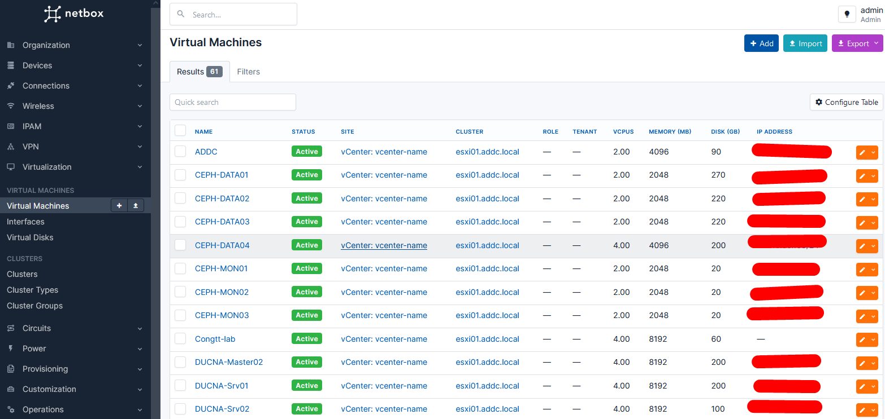

- [Cài đặt Netbox Sync](#cài-đặt-netbox-sync)
  - [1. Netbox Sync là gì?](#1-netbox-sync-là-gì)
  - [2. Cài đặt Netbox Sync kết hợp vCenter trên U22](#2-cài-đặt-netbox-sync-kết-hợp-vcenter-trên-u22)
    - [2.1 Các thư viện phụ trợ](#21-các-thư-viện-phụ-trợ)
    - [2.2 Cài đặt](#22-cài-đặt)
    - [2.3 Cấu trúc chạy Script trong Netbox Sync](#23-cấu-trúc-chạy-script-trong-netbox-sync)
- [Tài liệu tham khảo](#tài-liệu-tham-khảo)
# Cài đặt Netbox Sync
## 1. Netbox Sync là gì?
NetBox Sync là một tính năng của NetBox. Tính năng này cho phép NetBox tự động đồng bộ dữ liệu với các thiết bị và note nó lên trên Netbox

Những thiết bị mà Netbox Sync có thể đồng bộ được
- Switch 
- Router
- Server
- Virtual Machine
- ...

## 2. Cài đặt Netbox Sync kết hợp vCenter trên U22
### 2.1 Các thư viện phụ trợ
- python >= 3.6
- packaging
- urllib3==1.26.9
- wheel
- requests==2.27.1
- pyvmomi==7.0.3
- aiodns==2.0.0
- setuptools>=62.00.0
- pyyaml==6.0
- NetBox >= 2.9
- vsphere-automation-sdk
- check_redfish >= 1.2.0
### 2.2 Cài đặt
- Update và cài đặt python
  ```
  apt-get update
  apt install python3-dev
  apt install python3-venv
  ```
- Sao chép repo và cài đặt phụ thuộc
  ```
  cd /opt
  git clone https://github.com/bb-Ricardo/netbox-sync.git
  cd netbox-sync
  python3 -m venv .venv
  . .venv/bin/activate
  pip3 install --upgrade pip || pip install --upgrade pip
  pip3 install wheel || pip install wheel
  pip3 install -r requirements.txt || pip install -r requirements.txt
  ```
- Cài đặt `vsphere-automation-sdk` để có thể thao tác với VMware với câu lệnh chuẩn
  ```
  pip install --upgrade git+https://github.com/vmware/vsphere-automation-sdk-python.git
  ```
- Cài đặt tất cả các gói phụ thuộc python cần đễ thực hiện code của Netbox Sync
  ```
  pip install packaging urllib3==1.26.9 wheel requests==2.27.1 pyvmomi==7.0.3 aiodns==2.0.0 setuptools>=62.00.0 pyyaml==6.0
  pip install check_redfish>=1.2.0
  pip3 install packaging
  ```
- Red_fish là một ứng dụng giám sát ta cũng cần cài đặt
  ```
  cd /opt/netbox-sync/
  git clone https://github.com/bb-Ricardo/check_redfish.git
  cd check_redfish
  pip3 install -r requirements.txt || pip install -r requirements.txt
  ```
Đây là các thư mục ta thu được khi cài đặt thành công 


### 2.3 Cấu trúc chạy Script trong Netbox Sync
- Trong Netbox Sync có hỗ trợ 2 file cấu hình là yaml và ini 
- Dưới đây là cách sử dụng 2 file cấu hình đó
  ```
  usage: netbox-sync.py [-h] [-c settings.ini [settings.ini ...]] [-g]
                      [-l {DEBUG3,DEBUG2,DEBUG,INFO,WARNING,ERROR}] [-n] [-p]

  Sync objects from various sources to NetBox

  Version: 1.4.0 (2023-03-20)
  Project URL: https://github.com/bb-ricardo/netbox-sync

  options:
    -h, --help            show this help message and exit
    -c settings.ini [settings.ini ...], --config settings.ini [settings.ini ...]
                        points to the config file to read config data from
                        which is not installed under the default path
                        './settings.ini'
    -g, --generate_config
                        generates default config file.
    -l {DEBUG3,DEBUG2,DEBUG,INFO,WARNING,ERROR}, --log_level {DEBUG3,DEBUG2,DEBUG,INFO,WARNING,ERROR}
                        set log level (overrides config)
    -n, --dry_run         Operate as usual but don't change anything in NetBox.
                        Great if you want to test and see what would be
                        changed.
    -p, --purge           Remove (almost) all synced objects which were create
                        by this script. This is helpful if you want to start
                        fresh or stop using this script.
  ```
- Biết cách sử dụng ta cần phải tạo ra một file cấu hỉnh để sync dữ liệu từ vCenter về Netbox
  ```
  vi /opt/netbox-sync/vcenter-addc-local.ini
  ```
  Thêm vào nội dung sau:
  ```
  [common]
  log_level = DEBUG2
  [netbox]
  api_token = đã che 
  host_fqdn = 172.16.66.124
  port = 8000
  disable_tls = True
  prune_enabled = True
  prune_delay_in_days = 0
  [source/vcenter-name]
  type = vmware
  host_fqdn = đã che
  username = đã che
  password = đã che
  permitted_subnets = 172.16.66.0/24, 172.16.67.0/24, 172.16.68.0/24, 172.16.69.0/24, 192.168.99.0/24
  [source/my-redfish-example]
  type = check_redfish
  inventory_file_path = /opt/netbox-sync/check_redfish
  permitted_subnets = 172.16.66.0/24, 172.16.67.0/24, 172.16.68.0/24, 172.16.69.0/24, 192.168.99.0/24
  ```
  
- Giải thích
  - api_token = đã che : là api token của netbox
  - host_fqdn = 172.16.66.124 : IP của Netbox Server
  - port = 8000 : Ta có thể thay đổi port ứng với port mà Netbox sử dụng
  - disable_tls = True : Do netbox của mình dùng http nên ko cần tsl
  - prune_enabled = True : Cho phép xóa máy ảo không tồn tại
  - prune_delay_in_days = 0 : Thời gian delay là 0 ngày, có thể thay đổi
  - type = vmware : phân biệt vmware
  - host_fqdn = đã che : tên miền hoặc IP kết nối đến vcenter
  - username = Khai báo user đăng nhập vcenter
  - password = Pass
  permitted_subnets = 172.16.66.0/24, 172.16.67.0/24, 172.16.68.0/24, 172.16.69.0/24, 192.168.99.0/24 : Ta khai báo dòng này để khi sync các máy ảo sẽ hiển thị được các địa chỉ IP trùng với dải mạng này
  - Phần check_redfish cũng tương tự
- Đối với ssl local ta có thể sủa như sau:
  ```
  [common]
  log_level = DEBUG2
  [netbox]
  api_token = đã che 
  host_fqdn = 172.16.66.124
  port = 443
  disable_tls = False
  validate_tls_certs = True
  client_cert = client.pem
  client_cert_key = client.key
  prune_enabled = True
  prune_delay_in_days = 0
  [source/vcenter-name]
  type = vmware
  host_fqdn = đã che
  username = đã che
  password = đã che
  permitted_subnets = 172.16.66.0/24, 172.16.67.0/24, 172.16.68.0/24, 172.16.69.0/24, 192.168.99.0/24
  [source/my-redfish-example]
  type = check_redfish
  inventory_file_path = /opt/netbox-sync/check_redfish
  permitted_subnets = 172.16.66.0/24, 172.16.67.0/24, 172.16.68.0/24, 172.16.69.0/24, 192.168.99.0/24
  ```
- Sau khi tạo file cấu hình xong ta sẽ tiến hành chạy
  ```
  ./netbox-sync.py -c vcenter-addc-local.ini
  ```
- Ta đợi Netbox Sync chạy đồng bộ xong sẽ có kết quả
  

Như vậy là ta đã hoàn thành đồng bộ dữ liệu trên vCenter vào Netbox bằng netbox-sync
# Tài liệu tham khảo
https://github.com/huydv398/netbox-sync

https://github.com/bb-Ricardo/netbox-sync/blob/main/README.md


https://discuss.python.org/t/venv-trouble-with-python3-on-ubuntu-22-04-jammy/25890/13